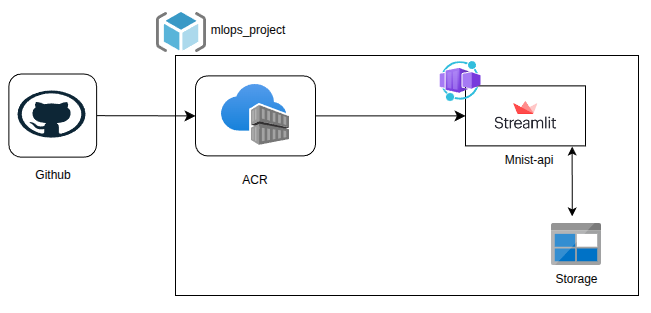

# MNIST ONNX – MLOps CI/CD (dev/prod) on Azure Container Apps

This repository implements an **automatic deployment system** for an existing **ONNX** model (MNIST digit classifier).
Every push to the **`dev`** and **`prod`** branches triggers a GitHub Actions pipeline that:

1. **Tests** the candidate model using test artifacts stored in **Azure Blob Storage**.
2. **Builds** a Docker image and **pushes** it to **Azure Container Registry (ACR)**.
3. **Deploys** by rolling out a **new Container Apps revision** (dev or prod) pointing to the new immutable image tag.

The running application is a small **Streamlit UI** where a user uploads an image of a digit and gets a prediction.
Each request is appended as a new line in a **TXT log file in Blob Storage** (one for dev and another for prod).

---

## Architecture



**Flow**
- Developer pushes to GitHub (`dev` or `prod`)
- GitHub Actions runs **test** + **build/promote**
- Image is pushed to **ACR**
- Azure Container Apps (`mnist-api-dev` / `mnist-api-prod`) rolls out a new revision with the new image
- App reads the **ONNX model** and **test artifacts** from **Azure Blob Storage**
- App writes prediction logs back to **Azure Blob Storage**

---

## What is deployed

- **Frontend**: Streamlit (single page)
- **Model runtime**: ONNX Runtime
- **Model file (external)**: stored in Azure Blob Storage, referenced via `MODEL_BLOB_PATH`
- **Logs (external)**: stored in Azure Blob Storage (append-only per request)

---

## Repository structure

```text
.
├── app/
│   ├── __init__.py
│   ├── main.py              # FastAPI API (kept for backend tests)
│   ├── streamlit_app.py     # Streamlit UI entrypoint
│   ├── onnx_inference.py
│   └── storage.py
├── tests/
│   └── test_model.py
├── .github/
│   └── workflows/
│       └── cicd.yml
├── Dockerfile
├── requirements.txt
├── .gitignore
└── README.md
```

---

## Azure resources used

- **Azure Storage Account (Blob Storage)**
  - Container: `proyecto-ml`
  - Blob paths used:
    - Model: `models/mnist-12.onnx`
    - Test input: `data/test_data_set_0/input_0.pb`
    - Test expected output: `data/test_data_set_0/output_0.pb`
    - Logs:
      - `logs/predicciones_dev.txt`
      - `logs/predicciones_prod.txt`

- **Azure Container Registry (ACR)**
  - Image name: `onnx-mlops-api`
  - Tags:
    - Floating: `dev`, `prod`
    - Immutable: `dev-<git_sha>`, `prod-<git_sha>`

- **Azure Container Apps**
  - Dev app: `mnist-api-dev`
  - Prod app: `mnist-api-prod`

---

## CI/CD pipeline (GitHub Actions)

Workflow: `.github/workflows/cicd.yml`

**Triggers**
- `push` to branch `dev`
- `push` to branch `prod`

**Stages**
1. **test**
   - Installs dependencies
   - Pulls the ONNX model and test artifacts from Blob Storage
   - Runs unit tests (at least two):
     - model produces output for a known input
     - output does not deviate beyond a tolerance (`MAX_TEST_OUTPUT_DIFF`)

2. **build/promote**
   - Builds Docker image
   - Pushes image to ACR
   - Rolls out a new Container Apps revision to effectively deploy the new model/UI

**GitHub Secrets used**
- `AZURE_CREDENTIALS` (Service Principal JSON for `azure/login`)
- `AZURE_CONTAINER_REGISTRY` (ACR name, e.g., `myregistry`)
- `AZURE_RESOURCE_GROUP` (resource group name)
- `AZURE_STORAGE_CONNECTION_STRING` (Blob access)

---

## How to use the deployed application (Dev/Prod)

**Steps**
1. Open the URL in your browser
2. Upload an image containing a handwritten digit (0–9)
3. Click **Predict**
4. The UI shows:
   - the uploaded image
   - a 28×28 grayscale preview
   - the predicted digit

**Where to see logs**
- In Azure Portal → Storage Account → Container `proyecto-ml` → `logs/`
  - `predicciones_dev.txt` grows with dev requests
  - `predicciones_prod.txt` grows with prod requests

---

